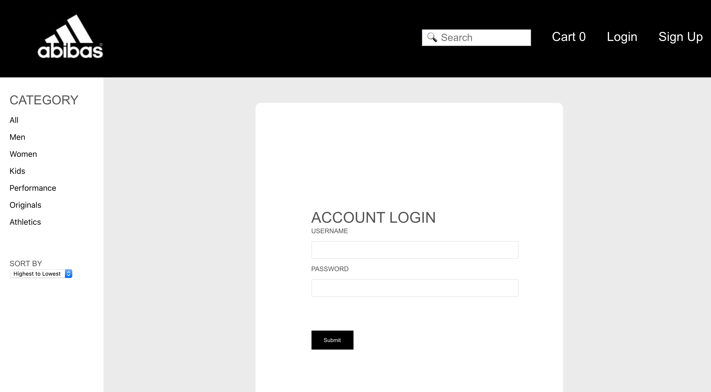
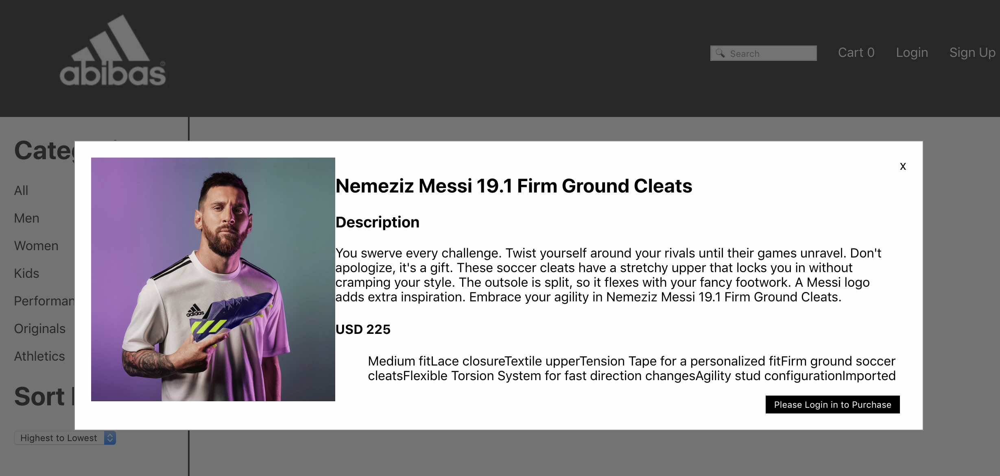

## Abibas

[View Live Site Here](https://abibas.netlify.com/)

## About
Abibas is an e-commerce application where you can purchase sporting goods based the popular Adidas. I choose do E-commerce because the application allows for a shopping experience by offer wider variety of options so that the user. I built Abibas through a 2 week sprint in which I used used Ruby on Rails for the backend, and React, Redux for the frontend. I partitioned it through 6 phrases which includes, designing the schema, implementing user authentication, extracting and displaying inventory information from a known company, handling transactions, and creating filtering and searching functions.

## Technologies

* Frontend: React, Redux, Vanilla CSS
* Backend: Ruby on Rails, PostgreSQL, Serializers
* Inventory Data: Addidas API from APIdojo (APIdojo.net)

## Features

### User Authentication
User Authentication is implemented using JWT auth and Bcrypt gem. Using an encryption, it will verify the token via the localstorage and grant access to the user. Error messages are generated default using validations via the backend. 



### Inventory Information
I used a live real-time Adidas API from API Dojo, through RapidAPI.com to retrieve adidas inventory information. Due to the limited scale of my project, I selected only some of the attributes that I want to use to build a basic minimal viable product of an E-commerce website. Because I can only make a limited amount of calls within the API, I retrieved the information via the backend and stored it within Postgres and upload it within Heroku.

```
response = RestClient::Request.execute(
  method: :get,
  url: 'https://apidojo-adidas-v1.p.rapidapi.com/products/v2/list?lang=en-US&limit=1000&url=men',
  headers: {"X-RapidAPI-Host": "apidojo-adidas-v1.p.rapidapi.com",
    "x-rapidapi-key": ENV["NYT_API_KEY"]}
)

product_data = JSON.parse(response)["_embedded"]["products"]

product_data.each do |dataInfo|
  
    Item.create(
    product_full_name: dataInfo["product_full_name"],
    original_price: dataInfo["original_price"],
    category: dataInfo["category"],
    gender: dataInfo["gender"],
    purchase_limit: dataInfo["purchase_limit"],
    description_headline: dataInfo["description_headline"],
    description_bullets: dataInfo["description_bullets"],
    image: dataInfo["_links"]["image_large"]["href"]
  )
end
```
### Handling Transactions
Due to the limited scale of my project, I disigned it so that the user must be logged in inorder for them to make a purchase. Upon registration there will be a cart dediciated to that user that will allow them to store products and revisit the website when they want to finalize their order. Once the person makes the purchase, the information will be saved and they can view their past purchases


### Displaying Product information
Once an item is clicked, a modal will popup and provide options that will allow the user to either add the item to the cart or continue shopping. Whenever there is a product information, upon clicking that item it will always display the item. 



### Filter and Search Bar
In order to allow for a more convinent user experience, the can filter products to narrow their search for a particular product. Users can filter based on price, gender, and category. They can also search for the product they want within the prospective category after filtering. 


### Future features
* A more comprehensive cart that updates quantity for duplicate items
* Implement Stripe API to process transactions